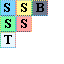

# Texturing
Si vous êtes ici, vous devez être graphiste. Si ce n'est pas le cas, vous pouvez retourner au [dossier principal](https://github.com/RRDDMC/YSG).

## Général
Ce dossier est dédié à la création des textures. Vous trouverez plus bas la liste des textures à créer.

## Création de textures
Les textures sont spécifiques aux modèles qu'elles complètent. Vous trouverez ici une liste des modèles et leurs textures de repérage.

### Blocs

## Liste des blocs à créer
- À venir...
